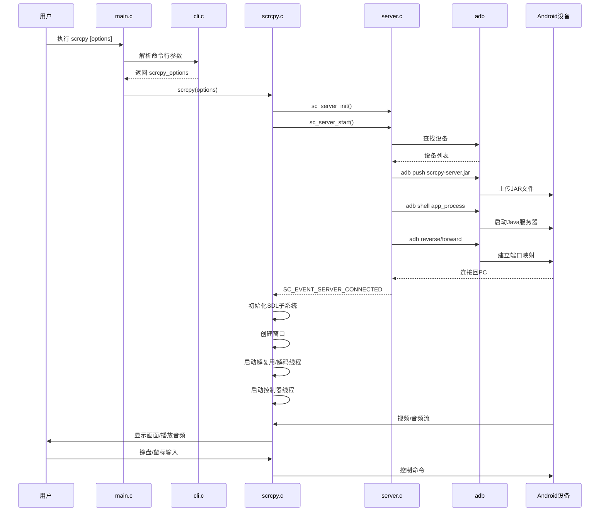

# Scrcpy 客户端架构和执行流程分析

## 📋 目录
1. [项目概述](#项目概述)
2. [整体架构](#整体架构)
3. [核心模块](#核心模块)
4. [执行流程](#执行流程)
5. [环境变量](#环境变量)
6. [命令行参数](#命令行参数)
7. [构建系统](#构建系统)

---

## 项目概述

Scrcpy 是一个用 C 语言编写的高性能 Android 设备镜像和控制工具,使用 SDL2 进行图形渲染,FFmpeg 进行音视频解码。

**技术栈:**
- **语言:** C (C99/C11标准)
- **图形库:** SDL2 (>= 2.0.5)
- **音视频:** FFmpeg (libavformat, libavcodec, libavutil, libswresample)
- **USB支持:** libusb-1.0 (可选)
- **V4L2支持:** libavdevice (Linux可选)
- **构建系统:** Meson

---

## 整体架构

### 架构层次图

```
┌─────────────────────────────────────────────────────────┐
│                    主程序入口 (main.c)                    │
└────────────────────┬────────────────────────────────────┘
                     │
                     ▼
┌─────────────────────────────────────────────────────────┐
│              命令行解析层 (cli.c/options.c)               │
│  - 解析100+个命令行参数                                    │
│  - 验证参数有效性                                          │
└────────────────────┬────────────────────────────────────┘
                     │
                     ▼
┌─────────────────────────────────────────────────────────┐
│                核心控制层 (scrcpy.c)                      │
│  - 初始化SDL子系统                                         │
│  - 协调各个模块                                            │
│  - 主事件循环                                              │
└────┬───────┬──────┬──────┬──────┬──────┬────────────────┘
     │       │      │      │      │      │
     ▼       ▼      ▼      ▼      ▼      ▼
┌────────┐ ┌────┐ ┌────┐ ┌────┐ ┌────┐ ┌─────────┐
│ Server │ │音视│ │输入│ │显示│ │录制│ │USB/AOA  │
│ 管理   │ │频解│ │控制│ │渲染│ │     │ │HID 控制 │
└────────┘ └────┘ └────┘ └────┘ └────┘ └─────────┘
```

### 模块依赖关系

```
main.c
  └─> cli.c (命令行解析)
       └─> scrcpy.c (核心逻辑)
            ├─> server.c (服务器管理)
            │    └─> adb/ (ADB通信)
            │         ├─> adb.c (ADB命令)
            │         ├─> adb_tunnel.c (隧道管理)
            │         └─> adb_parser.c (输出解析)
            │
            ├─> demuxer.c (音视频解复用)
            │    └─> decoder.c (解码器)
            │         └─> frame_buffer.c (帧缓冲)
            │
            ├─> screen.c (窗口管理)
            │    ├─> display.c (SDL渲染)
            │    └─> input_manager.c (输入事件)
            │
            ├─> controller.c (设备控制)
            │    ├─> keyboard_sdk.c / keyboard_uhid.c
            │    ├─> mouse_sdk.c / mouse_uhid.c
            │    └─> control_msg.c (控制消息)
            │
            ├─> audio_player.c (音频播放)
            │    └─> audio_regulator.c
            │
            ├─> recorder.c (录制)
            │
            └─> usb/ (USB直连,可选)
                 ├─> usb.c
                 ├─> aoa_hid.c (AOA HID协议)
                 ├─> keyboard_aoa.c
                 ├─> mouse_aoa.c
                 └─> gamepad_aoa.c
```

---

## 核心模块

### 1. **主程序入口 (main.c)**

```c
main()
  ├─ [Windows] 处理UTF-8参数转换
  └─ main_scrcpy()
       ├─ 禁用stdout/stderr缓冲
       ├─ 解析命令行参数 (scrcpy_parse_args)
       ├─ 设置日志级别
       ├─ 初始化网络库
       ├─ 执行主逻辑:
       │   ├─ OTG模式: scrcpy_otg() (USB直连)
       │   └─ 正常模式: scrcpy()
       └─ pause_on_exit 处理
```

**关键功能:**
- Windows下处理宽字符命令行参数
- 设置标准输出无缓冲(实时日志)
- 初始化主线程ID

### 2. **命令行解析 (cli.c)**

**定义的选项类型 (117个):**
```c
enum {
    // 音视频编码
    OPT_VIDEO_CODEC,          // --video-codec=h264/h265/av1
    OPT_AUDIO_CODEC,          // --audio-codec=opus/aac/flac/raw
    OPT_BIT_RATE,             // -b, --video-bit-rate
    OPT_AUDIO_BIT_RATE,       // --audio-bit-rate
    
    // 源选择
    OPT_VIDEO_SOURCE,         // --video-source=display/camera
    OPT_AUDIO_SOURCE,         // --audio-source=output/mic/playback/...
    
    // 显示控制
    OPT_MAX_SIZE,             // -m, --max-size
    OPT_MAX_FPS,              // --max-fps
    OPT_DISPLAY_ID,           // --display-id
    OPT_ROTATION,             // --rotation
    OPT_DISPLAY_ORIENTATION,  // --display-orientation
    
    // 输入模式
    OPT_KEYBOARD,             // --keyboard=disabled/sdk/uhid/aoa
    OPT_MOUSE,                // --mouse=disabled/sdk/uhid/aoa
    OPT_GAMEPAD,              // --gamepad=disabled/uhid/aoa
    
    // 网络配置
    OPT_TUNNEL_HOST,          // --tunnel-host
    OPT_TUNNEL_PORT,          // --tunnel-port
    OPT_TCPIP,                // --tcpip
    
    // 功能开关
    OPT_NO_AUDIO,             // --no-audio
    OPT_NO_VIDEO,             // --no-video
    OPT_NO_DISPLAY,           // --no-display
    OPT_NO_CONTROL,           // -n, --no-control
    OPT_NO_WINDOW,            // --no-window
    
    // 相机选项
    OPT_CAMERA_ID,            // --camera-id
    OPT_CAMERA_SIZE,          // --camera-size
    OPT_CAMERA_FACING,        // --camera-facing=front/back/external
    OPT_CAMERA_FPS,           // --camera-fps
    OPT_CAMERA_HIGH_SPEED,    // --camera-high-speed
    
    // 其他
    OPT_RECORD_FILE,          // -r, --record
    OPT_WINDOW_TITLE,         // --window-title
    OPT_ALWAYS_ON_TOP,        // --always-on-top
    OPT_LIST_ENCODERS,        // --list-encoders
    OPT_LIST_DISPLAYS,        // --list-displays
    OPT_LIST_CAMERAS,         // --list-cameras
    // ... 更多选项
};
```

**解析流程:**
```c
scrcpy_parse_args()
  ├─ 构建getopt_long结构
  ├─ 循环解析每个参数
  ├─ 验证参数组合的有效性
  │   ├─ 检查冲突选项
  │   ├─ 验证数值范围
  │   └─ 处理依赖关系
  └─ 填充scrcpy_options结构
```

### 3. **服务器管理 (server.c)**

**职责:**
- 通过 ADB 连接 Android 设备
- 推送 scrcpy-server.jar 到设备
- 启动服务器进程
- 建立视频/音频/控制 socket 连接

**服务器路径查找顺序:**
1. 环境变量 `SCRCPY_SERVER_PATH`
2. 安装路径 `PREFIX/share/scrcpy/scrcpy-server`  (非PORTABLE模式)
3. 可执行文件同目录 (PORTABLE模式)

**设备选择逻辑:**
```c
1. 命令行指定 --serial=<序列号>
2. 命令行 -d (--select-usb) 选择USB设备
3. 命令行 -e (--select-tcpip) 选择TCP/IP设备
4. 环境变量 ANDROID_SERIAL
5. 如果只有一个设备,自动选择
6. 多个设备时报错提示
```

**启动服务器命令示例:**
```bash
adb shell CLASSPATH=/data/local/tmp/scrcpy-server.jar \
    app_process / com.genymobile.scrcpy.Server \
    2.8 \                        # scrcpy版本
    scid=12345678 \              # scrcpy实例ID
    log_level=info \
    video_codec=h264 \
    audio_codec=opus \
    max_size=1920 \
    video_bit_rate=8000000 \
    audio_bit_rate=128000 \
    max_fps=60 \
    # ... 更多参数
```

### 4. **核心控制逻辑 (scrcpy.c)**

**主结构体:**
```c
struct scrcpy {
    struct sc_server server;                    // 服务器管理
    struct sc_screen screen;                    // 窗口和渲染
    struct sc_audio_player audio_player;        // 音频播放
    struct sc_demuxer video_demuxer;            // 视频解复用
    struct sc_demuxer audio_demuxer;            // 音频解复用
    struct sc_decoder video_decoder;            // 视频解码
    struct sc_decoder audio_decoder;            // 音频解码
    struct sc_recorder recorder;                // 录制器
    struct sc_delay_buffer video_buffer;        // 视频缓冲
    struct sc_controller controller;            // 控制器
    struct sc_file_pusher file_pusher;          // 文件推送
    
    // USB直连相关 (HAVE_USB)
    struct sc_usb usb;
    struct sc_aoa aoa;
    struct sc_acksync acksync;
    
    // 输入处理器 (union,根据模式选择)
    union {
        struct sc_keyboard_sdk keyboard_sdk;
        struct sc_keyboard_uhid keyboard_uhid;
        struct sc_keyboard_aoa keyboard_aoa;
    };
    union {
        struct sc_mouse_sdk mouse_sdk;
        struct sc_mouse_uhid mouse_uhid;
        struct sc_mouse_aoa mouse_aoa;
    };
    union {
        struct sc_gamepad_uhid gamepad_uhid;
        struct sc_gamepad_aoa gamepad_aoa;
    };
    
    struct sc_timeout timeout;                  // 时间限制
};
```

**执行流程:**
```c
scrcpy(options)
  │
  ├─ 1. 初始化SDL事件系统
  │
  ├─ 2. 初始化并启动服务器
  │    └─ sc_server_start()
  │         ├─ 查找设备
  │         ├─ 推送scrcpy-server.jar
  │         ├─ 启动服务器进程
  │         └─ 创建隧道线程
  │
  ├─ 3. 等待服务器连接
  │    └─ await_for_server()
  │
  ├─ 4. 初始化音视频子系统
  │    ├─ SDL_Init(SDL_INIT_VIDEO) [如果需要]
  │    ├─ SDL_Init(SDL_INIT_AUDIO) [如果需要]
  │    └─ SDL_Init(SDL_INIT_GAMECONTROLLER) [如果需要]
  │
  ├─ 5. 初始化解复用器和解码器
  │    ├─ sc_demuxer_init(&video_demuxer)
  │    ├─ sc_demuxer_init(&audio_demuxer)
  │    ├─ sc_decoder_init(&video_decoder)
  │    └─ sc_decoder_init(&audio_decoder)
  │
  ├─ 6. 初始化录制器 (如果指定)
  │    └─ sc_recorder_init()
  │
  ├─ 7. 初始化控制器 (如果启用控制)
  │    ├─ sc_controller_init()
  │    └─ 根据输入模式初始化:
  │         ├─ keyboard: sdk/uhid/aoa
  │         ├─ mouse: sdk/uhid/aoa
  │         └─ gamepad: uhid/aoa
  │
  ├─ 8. 初始化屏幕显示 (如果有窗口)
  │    └─ sc_screen_init()
  │
  ├─ 9. 启动所有线程
  │    ├─ sc_demuxer_start(&video_demuxer)
  │    ├─ sc_demuxer_start(&audio_demuxer)
  │    └─ sc_controller_start(&controller)
  │
  ├─ 10. 进入主事件循环
  │     └─ event_loop()
  │          └─ while (SDL_WaitEvent(&event)) {
  │               switch (event.type) {
  │                 case SC_EVENT_DEVICE_DISCONNECTED:
  │                 case SC_EVENT_DEMUXER_ERROR:
  │                 case SC_EVENT_CONTROLLER_ERROR:
  │                 case SDL_QUIT:
  │                 case 键盘/鼠标/窗口事件:
  │                   ...
  │               }
  │             }
  │
  └─ 11. 清理和退出
       ├─ 停止所有线程
       ├─ 关闭socket
       ├─ 释放资源
       └─ 返回退出码
```

### 5. **音视频处理流程**

```
Android设备
    │
    ├─ 视频编码器 (H.264/H.265/AV1)
    │   └─> [TCP Socket] 
    │        └─> video_demuxer (解复用线程)
    │             └─> video_decoder (解码线程)
    │                  └─> delay_buffer (可选)
    │                       └─> screen (渲染线程)
    │                            └─> SDL2渲染
    │
    └─ 音频编码器 (Opus/AAC/FLAC)
        └─> [TCP Socket]
             └─> audio_demuxer (解复用线程)
                  └─> audio_decoder (解码线程)
                       └─> audio_player
                            └─> SDL2音频输出
```

**录制流程 (同时进行):**
```
video_demuxer ──┬──> recorder (视频轨)
                │      └─> FFmpeg muxer
audio_demuxer ──┴──> recorder (音频轨)
                       └─> 输出文件 (MP4/MKV等)
```

### 6. **输入控制系统**

**三种输入模式:**

#### SDK模式 (默认)
```
用户输入 → SDL事件
    └─> input_manager
         └─> keyboard_sdk / mouse_sdk
              └─> controller
                   └─> [Control Socket]
                        └─> Android KeyEvent/MotionEvent
```

#### UHID模式 (模拟物理HID设备)
```
用户输入 → SDL事件
    └─> input_manager
         └─> keyboard_uhid / mouse_uhid
              └─> controller
                   └─> [Control Socket]
                        └─> Linux UHID驱动
                             └─> Android HID子系统
```

#### AOA模式 (USB直连)
```
用户输入 → SDL事件
    └─> input_manager
         └─> keyboard_aoa / mouse_aoa
              └─> aoa_hid
                   └─> [USB AOAv2协议]
                        └─> Android HID子系统
```

### 7. **ADB通信模块 (adb/)**

**模块组成:**
- `adb.c`: 执行adb命令 (devices, push, forward, reverse等)
- `adb_tunnel.c`: 管理adb隧道 (adb forward/reverse)
- `adb_parser.c`: 解析adb命令输出
- `adb_device.c`: 设备信息管理

**隧道模式:**
```
1. adb reverse (默认,推荐)
   Android设备 → localhost:27183 → PC
   
2. adb forward (备用)
   PC → localhost:27183 → Android设备
   
3. TCP/IP直连 (--tcpip)
   PC → device_ip:port → Android设备
```

---

## 执行流程

### 启动流程详解



### 事件循环

```c
event_loop() {
    while (SDL_WaitEvent(&event)) {
        switch (event.type) {
            // === 自定义事件 ===
            case SC_EVENT_DEVICE_DISCONNECTED:
                // 设备断开连接
                return SCRCPY_EXIT_DISCONNECTED;
                
            case SC_EVENT_DEMUXER_ERROR:
                // 解复用器错误
                return SCRCPY_EXIT_FAILURE;
                
            case SC_EVENT_CONTROLLER_ERROR:
                // 控制器错误
                return SCRCPY_EXIT_FAILURE;
                
            case SC_EVENT_TIME_LIMIT_REACHED:
                // 达到时间限制
                return SCRCPY_EXIT_SUCCESS;
                
            case SC_EVENT_RUN_ON_MAIN_THREAD:
                // 在主线程执行回调
                run_callback();
                break;
                
            // === SDL标准事件 ===
            case SDL_QUIT:
                // 用户关闭窗口
                return SCRCPY_EXIT_SUCCESS;
                
            case SDL_KEYDOWN:
            case SDL_KEYUP:
            case SDL_MOUSEMOTION:
            case SDL_MOUSEBUTTONDOWN:
            case SDL_MOUSEBUTTONUP:
            case SDL_MOUSEWHEEL:
            case SDL_WINDOWEVENT:
            case SDL_CONTROLLERDEVICEADDED:
            case SDL_CONTROLLERBUTTONDOWN:
                // 转发给screen处理
                sc_screen_handle_event(&screen, &event);
                break;
        }
    }
}
```

---

## 环境变量

### 使用的环境变量

| 环境变量 | 用途 | 默认值/说明 |
|---------|------|-----------|
| **SCRCPY_SERVER_PATH** | 指定scrcpy-server.jar路径 | 不设置则使用内置路径 |
| **ANDROID_SERIAL** | 默认连接的设备序列号 | 当多设备连接时使用 |
| **PATH** | 查找adb可执行文件 | Unix系统使用 |
| **_** | 存储当前执行程序路径 | Unix系统使用 |

### 环境变量使用示例

```bash
# 1. 指定自定义服务器路径
export SCRCPY_SERVER_PATH=/path/to/custom/scrcpy-server.jar
scrcpy

# 2. 指定默认设备
export ANDROID_SERIAL=192.168.1.100:5555
scrcpy  # 自动连接到该设备

# 3. 组合使用
ANDROID_SERIAL=emulator-5554 SCRCPY_SERVER_PATH=./debug-server.jar scrcpy -V debug
```

---

## 命令行参数

### 参数分类详解

#### 1. **视频参数**

```bash
# 编码和分辨率
--video-codec=h264|h265|av1          # 视频编码器 (默认: h264)
-b, --video-bit-rate=8M              # 视频比特率 (默认: 8Mbps)
-m, --max-size=1920                  # 最大尺寸(宽或高) (默认: 无限制)
--max-fps=60                         # 最大帧率 (默认: 设备默认)

# 视频源
--video-source=display|camera        # 视频源 (默认: display)
--display-id=0                       # 指定显示屏ID
--camera-id=0                        # 指定相机ID
--camera-facing=front|back|external  # 相机方向
--camera-size=1920x1080              # 相机分辨率
--camera-fps=30                      # 相机帧率

# 旋转和方向
--display-orientation=0|90|180|270   # 显示旋转
--capture-orientation=0|90|180|270   # 捕获旋转
--rotation=0|90|180|270              # (废弃)
--angle=45                           # 自定义旋转角度

# 其他
--crop=width:height:x:y              # 裁剪区域
--video-codec-options=key=value      # 编码器选项
--video-encoder=OMX.qcom.video.encoder.avc  # 指定编码器
```

#### 2. **音频参数**

```bash
# 基础设置
--audio-codec=opus|aac|flac|raw      # 音频编码器 (默认: opus)
--audio-bit-rate=128K                # 音频比特率 (默认: 128K)
--audio-source=output|mic|playback   # 音频源
  # output: 系统音频输出(独占)
  # playback: 应用播放音频(共享)
  # mic: 麦克风
  # mic-unprocessed: 未处理麦克风
  # mic-camcorder: 摄像机麦克风
  # mic-voice-recognition: 语音识别
  # mic-voice-communication: 语音通话
  # voice-call: 通话音频
  # voice-call-uplink: 通话上行
  # voice-call-downlink: 通话下行
  # voice-performance: 卡拉OK模式

# 缓冲设置
--audio-buffer=50                    # 音频缓冲(ms) (默认: 50)
--audio-output-buffer=5              # SDL输出缓冲(ms) (默认: 5)

# 其他
--audio-codec-options=key=value      # 编码器选项
--audio-encoder=...                  # 指定编码器
--audio-dup                          # 复制音频(设备继续播放)
```

#### 3. **显示和窗口参数**

```bash
# 窗口设置
--window-title="My Device"           # 窗口标题
--window-x=100                       # 窗口X坐标
--window-y=100                       # 窗口Y坐标
--window-width=800                   # 窗口宽度
--window-height=600                  # 窗口高度
--window-borderless                  # 无边框窗口
--always-on-top                      # 窗口置顶
-f, --fullscreen                     # 全屏
--no-window                          # 无窗口模式

# 渲染设置
--render-driver=opengl|opengles2|metal|direct3d  # 渲染驱动
--no-mipmaps                         # 禁用mipmaps
--disable-screensaver                # 禁用屏保

# 其他
--start-fps-counter                  # 显示FPS计数器
```

#### 4. **输入控制参数**

```bash
# 输入模式
--keyboard=disabled|sdk|uhid|aoa     # 键盘模式
  # disabled: 禁用键盘
  # sdk: Android SDK API (默认)
  # uhid: 模拟物理键盘(UHID)
  # aoa: USB AOA协议
  
--mouse=disabled|sdk|uhid|aoa        # 鼠标模式
--gamepad=disabled|uhid|aoa          # 游戏手柄模式

# 快捷键
-K  # 等同于 --keyboard=uhid (或 --keyboard=aoa 在OTG模式)
-M  # 等同于 --mouse=uhid
-G  # 等同于 --gamepad=uhid

# 键盘设置
--prefer-text                        # 优先使用文本注入
--raw-key-events                     # 发送原始按键事件
--no-key-repeat                      # 禁用按键重复
--shortcut-mod=lctrl,lalt            # 快捷键修饰符

# 鼠标设置
--mouse-bind=++::back                # 自定义鼠标按键
--no-mouse-hover                     # 禁用鼠标悬停事件
--legacy-paste                       # 使用旧版粘贴
--forward-all-clicks                 # 转发所有点击
```

#### 5. **网络和连接参数**

```bash
# 设备选择
-s, --serial=<序列号>                 # 指定设备序列号
-d, --select-usb                     # 选择USB设备
-e, --select-tcpip                   # 选择TCP/IP设备(包括模拟器)

# 网络配置
--tcpip[=<addr>]                     # TCP/IP连接
  # scrcpy --tcpip              # 自动查找无线设备
  # scrcpy --tcpip=192.168.1.100:5555

--tunnel-host=192.168.1.1            # 隧道主机
--tunnel-port=8000                   # 隧道端口
--port=27183:27199                   # 本地端口范围
--force-adb-forward                  # 强制使用adb forward
```

##### 🔍 **设备选择机制详解**

这几个参数控制 scrcpy 如何从多个已连接设备中选择目标设备,其选择逻辑按以下**优先级顺序**执行:

**选择优先级 (从高到低):**

```
1. --serial=<序列号> (-s)     [最高优先级,精确匹配]
2. --tcpip=<IP:端口>          [直接连接指定地址]
3. -d (--select-usb)          [选择物理USB设备]
4. -e (--select-tcpip)        [选择TCP/IP设备或模拟器]
5. 环境变量 ANDROID_SERIAL    [默认设备序列号]
6. 自动选择(仅一个设备时)      [最低优先级]
```

**⚠️ 互斥规则:** 以上参数最多只能使用一个,同时使用多个会报错。

---

**📱 设备类型识别规则**

Scrcpy 根据设备序列号格式自动判断设备类型:

```c
// 设备类型判断逻辑 (adb_device.c)

1. USB 设备: 
   - 序列号不包含 ':' 且不以 "emulator-" 开头
   - 例如: "R3CN90ABCD", "0123456789ABCDEF"

2. TCP/IP 设备:
   - 序列号包含 ':' (IP:端口格式)
   - 例如: "192.168.1.100:5555", "10.0.0.50:37845"

3. 模拟器:
   - 序列号以 "emulator-" 开头
   - 例如: "emulator-5554", "emulator-5556"
```

---

**🔧 参数工作原理**

**1️⃣ `-s, --serial=<序列号>` (精确匹配)**

```bash
# 完整匹配
scrcpy -s R3CN90ABCD           # USB设备
scrcpy -s 192.168.1.100:5555   # TCP/IP设备
scrcpy -s emulator-5554        # 模拟器

# IP部分匹配(便捷功能)
# 当设备是 192.168.1.100:5555 时
scrcpy -s 192.168.1.100        # 可以省略端口,匹配该IP的任意端口
```

**代码实现:**
```c
// server.c: 设置选择器类型
if (params->req_serial) {
    selector.type = SC_ADB_DEVICE_SELECT_SERIAL;
    selector.serial = params->req_serial;
}

// adb.c: 匹配逻辑
case SC_ADB_DEVICE_SELECT_SERIAL:
    // 如果设备是 IP:port 格式,且指定序列号没有端口
    // 则只比较IP部分,匹配 192.168.1.100 到 192.168.1.100:5555
    if (device_has_colon && !selector_has_colon) {
        return strncmp(selector->serial, device->serial, ip_length) == 0;
    }
    // 否则完全匹配
    return strcmp(selector->serial, device->serial) == 0;
```

**使用场景:**
- 明确知道设备序列号
- 多设备环境下指定目标
- 脚本自动化中使用

---

**2️⃣ `-d, --select-usb` (选择USB设备)**

```bash
# 当有多个设备连接时,只选择USB物理设备
scrcpy -d

# 等同于:
# adb -d shell ...
```

**工作流程:**
```
1. 执行 adb devices -l 获取所有设备列表
2. 过滤出 USB 类型设备(序列号不含 ':' 且非 emulator-)
3. 如果只有一个 USB 设备,选择它
4. 如果有多个 USB 设备,报错提示使用 -s 指定
```

**代码实现:**
```c
// server.c
} else if (params->select_usb) {
    selector.type = SC_ADB_DEVICE_SELECT_USB;
}

// adb.c: 过滤逻辑
case SC_ADB_DEVICE_SELECT_USB:
    return sc_adb_device_get_type(device->serial) == SC_ADB_DEVICE_TYPE_USB;
```

**使用场景:**
- 同时有USB设备和无线设备连接
- 只想操作物理连接的设备
- 避免误连接到模拟器

**示例输出:**
```
$ scrcpy -d
INFO: List of devices attached
       (usb)  R3CN90ABCD         device  Samsung Galaxy S21
   --> (usb)  0A1B2C3D4E5F       device  Pixel 6
      (tcpip) 192.168.1.100:5555 device  OnePlus 9
ERROR: Multiple USB devices, please specify one via -s
```

---

**3️⃣ `-e, --select-tcpip` (选择TCP/IP设备或模拟器)**

```bash
# 选择无线连接设备或模拟器(非USB设备)
scrcpy -e

# 等同于:
# adb -e shell ...
```

**工作流程:**
```
1. 执行 adb devices -l 获取所有设备列表
2. 过滤出非 USB 设备:
   - TCP/IP 设备 (IP:port)
   - 模拟器 (emulator-xxxx)
3. 如果只有一个此类设备,选择它
4. 如果有多个,报错提示使用 -s 指定
```

**代码实现:**
```c
// server.c
} else if (params->select_tcpip) {
    selector.type = SC_ADB_DEVICE_SELECT_TCPIP;
}

// adb.c: 过滤逻辑(排除USB)
case SC_ADB_DEVICE_SELECT_TCPIP:
    // 选择所有非USB设备(包括模拟器和TCP/IP)
    return sc_adb_device_get_type(device->serial) != SC_ADB_DEVICE_TYPE_USB;
```

**使用场景:**
- 同时有USB设备和无线/模拟器连接
- 只想操作无线设备或模拟器
- 测试环境中过滤真机

---

**4️⃣ `--tcpip[=<地址>]` (TCP/IP模式)**

这是一个特殊参数,有**两种用法**:

**用法A: 自动无线连接 (不带参数)**
```bash
# 自动将USB设备切换到无线模式
scrcpy --tcpip

# 执行流程:
# 1. 通过USB连接设备
# 2. 执行 adb tcpip 5555 (开启无线调试)
# 3. 获取设备IP地址 (adb shell ip route)
# 4. 执行 adb connect <IP>:5555
# 5. 通过无线连接镜像
```

**用法B: 直接连接指定地址 (带参数)**
```bash
# 直接连接到指定IP:端口
scrcpy --tcpip=192.168.1.100:5555

# 如果设备已连接,先断开再重连(强制重连)
scrcpy --tcpip=+192.168.1.100:5555
```

**代码实现:**
```c
// server.c: 处理 --tcpip 参数

// 情况1: --tcpip (无地址)
if (params->tcpip && !params->tcpip_dst) {
    // 从已选设备切换到TCP/IP
    ok = sc_server_configure_tcpip_unknown_address(server, device.serial);
    // 内部执行:
    //   1. adb -s <serial> tcpip 5555
    //   2. adb -s <serial> shell ip route (获取IP)
    //   3. adb connect <IP>:5555
}

// 情况2: --tcpip=<addr>
if (params->tcpip_dst) {
    const char *addr = params->tcpip_dst;
    bool disconnect_first = (addr[0] == '+');  // 检查 + 前缀
    
    if (disconnect_first) {
        addr++;  // 跳过 '+'
        sc_adb_disconnect(&server->intr, addr, 0);  // 先断开
    }
    
    sc_adb_connect(&server->intr, addr, 0);  // 执行 adb connect
}
```

**使用场景:**
- 无线调试和镜像
- 设备无法物理连接到电脑
- USB端口不足

**注意事项:**
- 首次使用需要USB连接来启用tcpip模式
- 需要设备和PC在同一网络
- 性能可能略低于USB连接
- 某些设备需要在开发者选项中启用"无线调试"

---

**5️⃣ 环境变量 `ANDROID_SERIAL`**

```bash
# 设置默认设备
export ANDROID_SERIAL=R3CN90ABCD

# 之后所有scrcpy命令默认使用该设备
scrcpy                  # 自动使用 R3CN90ABCD
scrcpy --max-size=720   # 自动使用 R3CN90ABCD

# 临时覆盖
scrcpy -s emulator-5554  # 使用模拟器,忽略环境变量
```

**代码实现:**
```c
// server.c: 环境变量检查
} else {
    // 没有明确选择参数时,检查环境变量
    const char *env_serial = getenv("ANDROID_SERIAL");
    if (env_serial) {
        LOGI("Using ANDROID_SERIAL: %s", env_serial);
        selector.type = SC_ADB_DEVICE_SELECT_SERIAL;
        selector.serial = env_serial;
    } else {
        selector.type = SC_ADB_DEVICE_SELECT_ALL;  // 自动选择
    }
}
```

**使用场景:**
- 长期开发固定设备
- 避免每次输入 -s 参数
- Shell脚本中设置默认设备

---

**6️⃣ 自动选择 (无参数)**

```bash
# 不指定任何选择参数
scrcpy
```

**行为:**
```
if (设备数量 == 0) {
    ERROR: 没有找到设备
} else if (设备数量 == 1) {
    自动选择该设备  ✓
} else {  // 多个设备
    ERROR: 多个设备,请使用 -s/-d/-e 指定
}
```

**错误示例:**
```
$ scrcpy
ERROR: Multiple devices:
       (usb)  R3CN90ABCD         device  Samsung Galaxy S21
      (tcpip) 192.168.1.100:5555 device  Pixel 6
      (tcpip) emulator-5554      device  Android Emulator
Use -s, -d, -e or --tcpip=<addr> to select a device
```

---

**🎯 实战示例**

**场景1: 只连接一个USB设备**
```bash
# 不需要任何参数,自动选择
scrcpy
```

**场景2: 同时连接USB设备和模拟器**
```bash
scrcpy -d           # 选择USB设备
scrcpy -e           # 选择模拟器
scrcpy -s R3CN90ABCD    # 精确指定USB设备
scrcpy -s emulator-5554 # 精确指定模拟器
```

**场景3: 多个USB设备**
```bash
# 必须使用 -s 精确指定
scrcpy -s R3CN90ABCD
scrcpy -s 0A1B2C3D4E5F
```

**场景4: 无线连接**
```bash
# 方法1: 从USB切换到无线(自动)
adb devices           # 确保USB已连接
scrcpy --tcpip        # 自动切换并连接

# 方法2: 手动连接
adb tcpip 5555
adb connect 192.168.1.100:5555
scrcpy -s 192.168.1.100:5555

# 方法3: 直接连接(需要设备已在无线模式)
scrcpy --tcpip=192.168.1.100:5555

# 方法4: 强制重连
scrcpy --tcpip=+192.168.1.100:5555
```

**场景5: 混合环境(USB + 无线 + 模拟器)**
```bash
$ adb devices
List of devices attached
R3CN90ABCD             device    # USB真机
192.168.1.100:5555     device    # 无线真机
10.0.0.50:37845        device    # 另一无线设备
emulator-5554          device    # 模拟器

# 选择策略:
scrcpy -d                          # 选择 R3CN90ABCD (唯一USB)
scrcpy -e                          # ERROR: 多个非USB设备
scrcpy -s 192.168.1.100:5555       # 精确选择无线设备
scrcpy -s 192.168.1.100            # 同样选择(IP匹配)
scrcpy -s emulator-5554            # 选择模拟器
```

**场景6: 脚本自动化**
```bash
#!/bin/bash
# 多设备测试脚本

# 设置默认设备
export ANDROID_SERIAL=R3CN90ABCD

# 测试设备1
scrcpy --record=test_device1.mp4 --time-limit=60

# 切换到设备2(覆盖环境变量)
scrcpy -s emulator-5554 --record=test_device2.mp4 --time-limit=60

# 切换到无线设备
scrcpy --tcpip=192.168.1.100:5555 --record=test_wireless.mp4
```

---

**📊 设备选择流程图**

```
启动 scrcpy
    │
    ├─ 有 --tcpip=<addr>? ────→ YES → adb connect <addr> → 使用该设备
    │                                                          ↓
    ↓ NO                                                    连接成功?
    │                                                          │
    ├─ 执行 adb devices -l                                     ├─ YES → 继续
    │   获取所有已连接设备列表                                   └─ NO → 错误退出
    │
    ├─ 应用过滤器:
    │   ├─ 有 -s <serial>? ──→ 匹配序列号
    │   ├─ 有 -d?          ──→ 过滤 USB 设备
    │   ├─ 有 -e?          ──→ 过滤 TCP/IP + 模拟器
    │   ├─ 有 ANDROID_SERIAL? → 匹配环境变量
    │   └─ 无               ──→ 选择所有设备
    │
    ├─ 匹配设备数量:
    │   ├─ 0 个 → ERROR: 没有匹配的设备
    │   ├─ 1 个 → 选择该设备 ✓
    │   └─ >1个 → ERROR: 多个设备,请明确指定
    │
    ├─ 检查设备状态:
    │   ├─ "device"       → 正常,继续 ✓
    │   ├─ "unauthorized" → ERROR: 未授权,检查设备弹窗
    │   ├─ "offline"      → ERROR: 设备离线
    │   └─ 其他状态        → ERROR: 设备不可用
    │
    ├─ 有 --tcpip (无地址)?
    │   └─ YES → 切换设备到无线模式
    │       ├─ adb tcpip 5555
    │       ├─ 获取设备IP
    │       ├─ adb connect IP:5555
    │       └─ 更新设备序列号为 IP:5555
    │
    └─ 推送 scrcpy-server.jar
        └─ 建立连接并开始镜像
```

---

**⚙️ ADB 可执行文件查找**

Scrcpy 按以下顺序查找 adb 命令:

```c
// adb.c: adb 路径初始化

1. 环境变量 ADB
   export ADB=/path/to/custom/adb
   
2. 可移植模式 (PORTABLE 编译选项)
   查找 scrcpy 可执行文件同目录下的 adb
   
3. 系统 PATH
   直接使用 "adb" 命令(需在PATH中)
```

**自定义ADB路径:**
```bash
# 临时使用自定义adb
ADB=/opt/android-sdk/platform-tools/adb scrcpy

# 永久设置
export ADB=/opt/android-sdk/platform-tools/adb
scrcpy
```

---

**🌐 其他网络配置参数详解**

**7️⃣ `--tunnel-host` 和 `--tunnel-port` (隧道配置)**

这两个参数用于**端口转发隧道**场景,当PC无法直接连接设备,需要通过中间主机转发时使用。

```bash
# 通过SSH隧道连接远程设备
--tunnel-host=<主机IP>    # 隧道主机地址
--tunnel-port=<端口>      # 隧道端口(默认: 27183)
```

**使用场景:**
```
┌─────────┐      SSH隧道      ┌───────────┐      USB/网络      ┌─────────┐
│  本地PC  │ ←─────────────→ │ 远程服务器  │ ←─────────────→ │ Android │
│ scrcpy  │  tunnel-host    │    adb     │                  │  设备   │
└─────────┘                  └───────────┘                  └─────────┘
```

**实战示例:**
```bash
# 步骤1: 在远程服务器上启动adb并建立端口转发
ssh user@remote-server
adb devices                    # 确保设备已连接
adb forward tcp:27183 localabstract:scrcpy_12345678

# 步骤2: 在远程服务器上建立SSH隧道
# (或者从本地PC执行)
ssh -L 27183:localhost:27183 user@remote-server

# 步骤3: 在本地PC运行scrcpy
scrcpy --tunnel-host=remote-server --tunnel-port=27183
```

**代码实现:**
```c
// server.c: 隧道参数传递给服务器
struct sc_server_params params = {
    .tunnel_host = options->tunnel_host,    // 隧道主机
    .tunnel_port = options->tunnel_port,    // 隧道端口
    .port_range = options->port_range,      // 本地端口范围
    // ...
};
```

---

**8️⃣ `--port=<首端口>:<尾端口>` (端口范围)**

指定本地监听的端口范围,用于 adb reverse 或 adb forward 隧道。

```bash
--port=27183:27199   # 默认范围(允许17个连接)
--port=30000:30010   # 自定义范围
--port=8000:8000     # 固定单一端口
```

**工作原理:**
```c
// adb_tunnel.c: 端口分配
// scrcpy 使用 3 个端口:
// 1. 视频流端口
// 2. 音频流端口  
// 3. 控制流端口

// 从指定范围选择连续的3个可用端口
uint16_t first_port = port_range.first;  // 例如: 27183
uint16_t last_port = port_range.last;    // 例如: 27199

for (uint16_t port = first_port; port <= last_port - 2; port++) {
    // 尝试绑定 port, port+1, port+2
    if (all_three_ports_available(port)) {
        video_port = port;
        audio_port = port + 1;
        control_port = port + 2;
        break;
    }
}
```

**使用场景:**
- 避免端口冲突
- 企业环境有防火墙限制
- 同时运行多个scrcpy实例
- 特定端口范围要求

**多实例示例:**
```bash
# 同时镜像多个设备
scrcpy -s device1 --port=27183:27185 &   # 使用 27183-27185
scrcpy -s device2 --port=27186:27188 &   # 使用 27186-27188
scrcpy -s device3 --port=27189:27191 &   # 使用 27189-27191
```

---

**9️⃣ `--force-adb-forward` (强制使用adb forward)**

强制使用 `adb forward` 而不是 `adb reverse` 来建立隧道。

```bash
scrcpy --force-adb-forward
```

**adb reverse vs adb forward:**

| 特性 | adb reverse (默认) | adb forward (备用) |
|------|-------------------|-------------------|
| **连接方向** | 设备 → PC | PC → 设备 |
| **端口监听** | PC监听端口 | 设备监听端口 |
| **性能** | 较好 | 略差 |
| **兼容性** | Android 5.0+ | 所有版本 |
| **网络要求** | 设备主动连接PC | PC主动连接设备 |

**adb reverse (默认):**
```
1. PC 启动 scrcpy,监听本地端口 (如 27183-27185)
2. 执行: adb reverse localabstract:scrcpy_xxx tcp:27183
3. 设备上的 scrcpy-server 连接 localabstract:scrcpy_xxx
4. 数据从设备 → PC本地端口
```

**adb forward (强制使用时):**
```
1. 设备上 scrcpy-server 启动,监听 localabstract:scrcpy_xxx
2. 执行: adb forward tcp:27183 localabstract:scrcpy_xxx
3. PC 连接 localhost:27183
4. 数据从 PC本地端口 → 设备
```

**代码实现:**
```c
// adb_tunnel.c: 隧道模式选择
bool sc_adb_tunnel_open(..., bool force_adb_forward) {
    if (!force_adb_forward) {
        // 尝试 adb reverse
        bool reverse_ok = sc_adb_reverse(...);
        if (reverse_ok) {
            tunnel->forward = false;
            return true;
        }
        LOGW("adb reverse failed, fallback to adb forward");
    }
    
    // 使用 adb forward
    bool forward_ok = sc_adb_forward(...);
    if (forward_ok) {
        tunnel->forward = true;
        return true;
    }
    
    return false;
}
```

**使用场景:**
- 旧设备不支持 adb reverse (Android < 5.0)
- adb reverse 失败时的备用方案
- 特定网络环境要求
- 调试和问题排查

---

**🔗 连接方式对比总结**

| 连接方式 | 命令示例 | 适用场景 | 性能 | 复杂度 |
|---------|---------|---------|------|--------|
| **USB直连** | `scrcpy` | 默认,最简单 | ⭐⭐⭐⭐⭐ | ⭐ |
| **无线自动** | `scrcpy --tcpip` | USB初始化后切换 | ⭐⭐⭐⭐ | ⭐⭐ |
| **无线指定** | `scrcpy --tcpip=192.168.1.100:5555` | 已知设备IP | ⭐⭐⭐⭐ | ⭐⭐ |
| **adb reverse** | `scrcpy` (默认) | 设备主动连接 | ⭐⭐⭐⭐⭐ | ⭐ |
| **adb forward** | `scrcpy --force-adb-forward` | PC主动连接 | ⭐⭐⭐⭐ | ⭐ |
| **SSH隧道** | `scrcpy --tunnel-host=...` | 远程设备 | ⭐⭐⭐ | ⭐⭐⭐⭐⭐ |

---

**💡 最佳实践建议**

1. **单设备开发**: 不使用任何参数,让scrcpy自动选择
2. **多设备开发**: 使用 `ANDROID_SERIAL` 环境变量设置默认设备
3. **无线调试**: 首次使用 `--tcpip` 自动配置,后续直接用 `-s IP:port`
4. **团队协作**: 统一使用 `-s` 参数在脚本中明确指定设备
5. **性能优先**: 优先使用USB连接,必要时才用无线
6. **端口冲突**: 多实例运行时使用 `--port` 指定不同范围
7. **兼容性**: 旧设备遇到问题时尝试 `--force-adb-forward`

#### 6. **录制参数**

```bash
-r, --record=file.mp4                # 录制到文件
--record-format=mp4|mkv|m4a|opus|aac|flac|wav
  # 视频格式: mp4, mkv
  # 音频格式: m4a, mka, opus, aac, flac, wav

--record-orientation=0|90|180|270    # 录制方向

# 示例
scrcpy -r recording.mp4              # 录制视频+音频
scrcpy -r audio.opus --no-video      # 仅录制音频
```

#### 7. **设备控制参数**

```bash
# 屏幕控制
-S, --turn-screen-off                # 镜像时关闭屏幕
--power-off-on-close                 # 退出时关闭屏幕
--power-on                           # 启动时打开屏幕(默认)
--no-power-on                        # 不在启动时打开屏幕
--screen-off-timeout=10              # 屏幕超时(秒)

# 设备状态
-w, --stay-awake                     # 保持唤醒
--show-touches                       # 显示触摸点

# 其他
--start-app=com.example.app          # 启动应用
--new-display=1920x1080/240          # 创建虚拟显示器
--display-ime-policy=local|fallback|hide  # IME显示策略
```

#### 8. **功能开关参数**

```bash
# 禁用功能
-n, --no-control                     # 禁用控制(只显示)
--no-audio                           # 禁用音频
--no-video                           # 禁用视频
--no-audio-playback                  # 禁用音频播放
--no-video-playback                  # 禁用视频播放
--no-clipboard-autosync              # 禁用剪贴板同步
--no-downsize-on-error               # 错误时不降低分辨率
--no-cleanup                         # 不清理设备文件

# 其他
--require-audio                      # 要求音频(失败则退出)
--time-limit=60                      # 运行时间限制(秒)
--pause-on-exit[=if-error]           # 退出时暂停
```

#### 9. **调试和信息参数**

```bash
# 日志
-V, --verbosity=verbose|debug|info|warn|error  # 日志级别

# 列表信息
--list-encoders                      # 列出编码器
--list-displays                      # 列出显示器
--list-cameras                       # 列出相机
--list-camera-sizes                  # 列出相机分辨率
--list-apps                          # 列出应用

# 其他
-v, --version                        # 显示版本
-h, --help                           # 显示帮助
--kill-adb-on-close                  # 退出时关闭adb
```

#### 10. **USB OTG模式**

```bash
--otg                                # OTG模式(USB直连,无需ADB)

# OTG模式下只支持输入控制,不支持视频/音频
scrcpy --otg                         # 完整控制
scrcpy --otg -K                      # 仅键盘
scrcpy --otg -M                      # 仅鼠标
```

#### 11. **V4L2输出 (Linux)**

```bash
--v4l2-sink=/dev/video2              # 输出到V4L2设备
--v4l2-buffer=100                    # V4L2缓冲(ms)

# 示例: 将Android相机输出为虚拟摄像头
scrcpy --video-source=camera --v4l2-sink=/dev/video2 --no-window
```

### 常用命令组合示例

```bash
# 1. 高质量录屏
scrcpy -b 16M -r recording.mp4 --max-fps=60

# 2. 无线连接
scrcpy --tcpip=192.168.1.100:5555

# 3. 仅控制,不显示
scrcpy --no-video --no-audio

# 4. 游戏模式(低延迟)
scrcpy --video-buffer=0 --audio-buffer=10 --max-fps=120

# 5. 镜像相机
scrcpy --video-source=camera --camera-facing=back --camera-size=1920x1080

# 6. 录制音频通话
scrcpy --no-video --audio-source=voice-call -r call.opus

# 7. 虚拟显示器
scrcpy --new-display=1920x1080/240 --start-app=com.example.game

# 8. 键鼠物理模拟(用于游戏)
scrcpy -K -M --no-clipboard-autosync

# 9. 同时录制和显示,关闭设备屏幕省电
scrcpy -S -r gameplay.mp4 --power-off-on-close

# 10. 指定设备和自定义窗口
scrcpy -s emulator-5554 --window-title="Emulator" --window-width=720 --window-height=1280
```

---

## 构建系统

### Meson构建配置

**主要配置选项 (meson_options.txt):**
```ini
option('portable', type: 'boolean', value: false)
  # 便携版本(服务器JAR在可执行文件同目录)

option('server_debugger', type: 'boolean', value: false)
  # 启用服务器调试器

option('v4l2', type: 'boolean', value: true)
  # V4L2支持(仅Linux)

option('usb', type: 'boolean', value: true)
  # USB/AOA支持

option('static', type: 'boolean', value: false)
  # 静态链接依赖库
```

**构建命令:**
```bash
# 1. 配置构建
meson setup build_dir --buildtype=release -Dportable=true

# 2. 编译
meson compile -C build_dir

# 3. 安装
meson install -C build_dir

# 4. 运行测试
meson test -C build_dir
```

**依赖库要求:**
```
libavformat >= 57.33
libavcodec >= 57.37
libavutil (任意版本)
libswresample (任意版本)
SDL2 >= 2.0.5
libavdevice (V4L2支持需要)
libusb-1.0 (USB支持需要)
```

**平台特定源文件:**
```c
// Windows
src/sys/win/file.c
src/sys/win/process.c

// Unix (Linux/macOS)
src/sys/unix/file.c
src/sys/unix/process.c
```

**预处理器定义:**
```c
_POSIX_C_SOURCE=200809L
_XOPEN_SOURCE=700
_GNU_SOURCE=1

// Windows
_WIN32_WINNT=0x0600
WINVER=0x0600

// macOS
_DARWIN_C_SOURCE=1

// 功能开关
HAVE_V4L2=1        // V4L2支持
HAVE_USB=1         // USB支持
PORTABLE=1         // 便携模式
SERVER_DEBUGGER=1  // 服务器调试

// 版本
SCRCPY_VERSION="2.8"
PREFIX="/usr/local"
```

### 单元测试

**测试文件 (tests/):**
- `test_adb_parser.c` - ADB输出解析
- `test_audiobuf.c` - 音频缓冲
- `test_binary.c` - 二进制操作
- `test_cli.c` - 命令行解析
- `test_control_msg_serialize.c` - 控制消息序列化
- `test_device_msg_deserialize.c` - 设备消息反序列化
- `test_orientation.c` - 方向计算
- `test_str.c` - 字符串工具
- `test_strbuf.c` - 字符串缓冲
- `test_vecdeque.c` - 向量双端队列
- `test_vector.c` - 向量

---

## 线程模型

### 主要线程

```
主线程 (main thread)
  ├─ SDL事件循环
  ├─ 窗口渲染
  └─ UI交互处理

服务器线程 (server thread)
  ├─ 启动ADB服务器
  ├─ 建立连接
  └─ 监听断开

视频解复用线程 (video demuxer)
  ├─ 从socket读取视频流
  ├─ 解析AVPacket
  └─ 分发到解码器和录制器

音频解复用线程 (audio demuxer)
  ├─ 从socket读取音频流
  ├─ 解析AVPacket
  └─ 分发到解码器和录制器

视频解码线程 (video decoder)
  ├─ 解码AVPacket
  └─ 输出AVFrame

音频解码线程 (audio decoder)
  ├─ 解码AVPacket
  └─ 输出AVFrame

控制器线程 (controller thread)
  ├─ 接收输入事件
  ├─ 序列化控制消息
  └─ 发送到设备

录制器线程 (recorder thread)
  ├─ 接收音视频包
  ├─ mux到文件
  └─> 输出文件

AOA线程 (USB模式)
  ├─ USB事件处理
  └─ HID报告发送

文件推送线程 (file pusher)
  └─ 处理拖放文件上传
```

### 线程同步

**使用的同步原语:**
- `sc_mutex` - 互斥锁
- `sc_cond` - 条件变量
- `sc_thread` - 线程抽象
- `sc_intr` - 中断信号 (用于优雅终止)

---

## 数据流图

```
┌──────────────────────────────────────────────────────┐
│                    Android 设备                        │
│                                                        │
│  ┌──────────────┐  ┌──────────────┐  ┌────────────┐  │
│  │ Display/     │  │ AudioTrack/  │  │  InputFlinger│ │
│  │ Camera       │  │ Microphone   │  │            │  │
│  └──────┬───────┘  └──────┬───────┘  └─────▲──────┘  │
│         │                 │                 │         │
│  ┌──────▼─────────────────▼─────────────────┼──────┐  │
│  │         scrcpy-server (Java)             │      │  │
│  │  - MediaCodec 编码                       │      │  │
│  │  - Socket 通信                           │      │  │
│  │  - 输入注入                               │      │  │
│  └──────┬─────────────┬───────────────────┬─┘      │  │
│         │ (video)     │ (audio)           │(control)│
└─────────┼─────────────┼───────────────────┼────────┘
          │             │                   │
      [TCP/USB]     [TCP/USB]          [TCP/USB]
          │             │                   │
┌─────────▼─────────────▼───────────────────▼────────┐
│                    scrcpy (C客户端)                  │
│                                                     │
│  ┌──────────┐    ┌──────────┐    ┌──────────────┐ │
│  │ Video    │    │ Audio    │    │ Controller   │ │
│  │ Demuxer  │    │ Demuxer  │    │ (send input) │ │
│  └────┬─────┘    └────┬─────┘    └──────▲───────┘ │
│       │               │                  │         │
│  ┌────▼─────┐    ┌────▼─────┐    ┌──────┴───────┐ │
│  │ Video    │    │ Audio    │    │ Input        │ │
│  │ Decoder  │    │ Decoder  │    │ Manager      │ │
│  └────┬─────┘    └────┬─────┘    └──────▲───────┘ │
│       │               │                  │         │
│  ┌────▼─────┐    ┌────▼─────┐    ┌──────┴───────┐ │
│  │ SDL      │    │ SDL      │    │ SDL          │ │
│  │ Renderer │    │ Audio    │    │ Events       │ │
│  └────┬─────┘    └────┬─────┘    └──────────────┘ │
│       │               │                            │
└───────┼───────────────┼────────────────────────────┘
        │               │
        ▼               ▼
    显示器          音频设备
```

---

## 总结

### 设计特点

1. **模块化架构**: 清晰的模块划分,易于维护和扩展
2. **多线程并发**: 充分利用多核性能,各模块独立运行
3. **跨平台支持**: Windows/Linux/macOS统一代码库
4. **灵活配置**: 100+个命令行参数,满足各种使用场景
5. **高性能**: 
   - 使用硬件编解码
   - 零拷贝数据传输
   - 低延迟设计(<50ms)

### 关键技术点

- **视频编码**: H.264/H.265/AV1 (Android MediaCodec)
- **音频编码**: Opus/AAC/FLAC/RAW
- **通信协议**: 自定义TCP二进制协议
- **输入模拟**: Android SDK API / Linux UHID / USB AOA
- **跨平台**: POSIX + Windows API 抽象层
- **构建工具**: Meson (现代化,快速)

### 性能优化策略

1. **视频流**: 可调节分辨率/码率/帧率
2. **音频流**: 可调节缓冲大小
3. **网络**: adb reverse优先(性能更好)
4. **渲染**: OpenGL硬件加速,mipmap优化
5. **输入**: 批量发送,减少延迟

---

**文档版本**: 1.0  
**基于代码版本**: scrcpy 2.x  
**分析日期**: 2026-01-23

